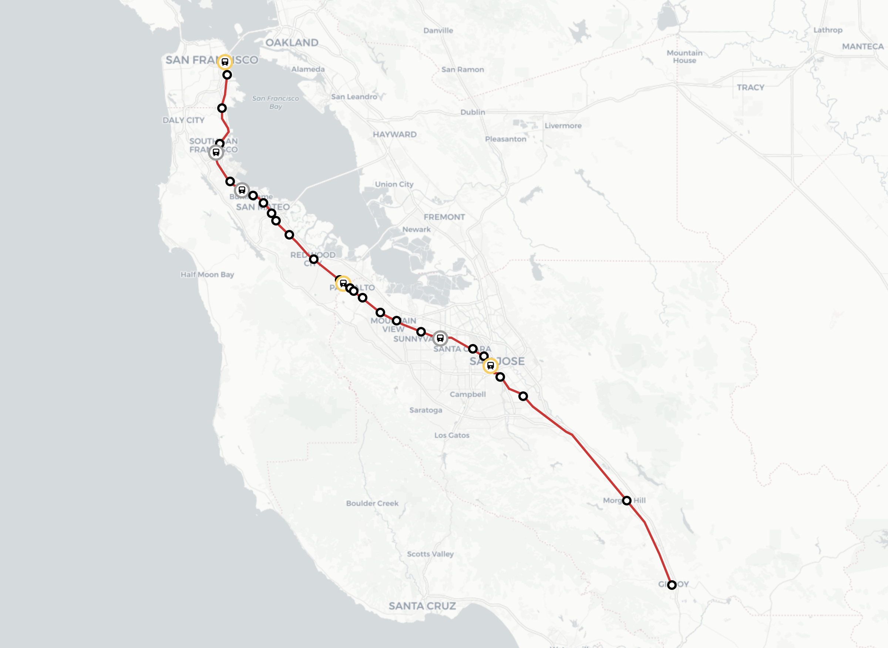

# caltrain_map

Caltrain Map shows realtime Caltrain locations on a map using the 511.org API with python.



## Installation

To install all of the dependencies, run the following command:

```bash
# Linux/macOS
python3 -m pip install -r requirements.txt

# Windows
py -3 -m pip install -r requirements.txt
```

## Usage
You must run the project by running export_map.py
```bash
# Linux/macOS:
python3 export_map.py

# Windows
py export_map.py
```
